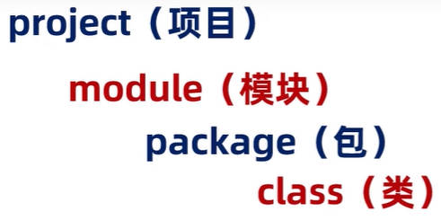

# Java 开发工具

## 一、VSCode Java 环境配置

### 1.VSCode 插件安装

安装 VSCode 插件包 [Extension Pack for Java](https://marketplace.visualstudio.com/items?itemName=vscjava.vscode-java-pack)、[Spring Boot Extension Pack](https://marketplace.visualstudio.com/items?itemName=vmware.vscode-boot-dev-pack)。

插件安装完成后，资源管理器会多出一个“创建 Java 项目”的按钮。

- 或者使用 Ctrl + Shift + P，选择“创建 Java 项目”。
- 或者使用 F1，选择“创建 Java 项目”。

#### 1.Java 项目创建

1. 使用 Ctrl + Shift + P，选择”创建 Java 项目“
2. 选择”No build tools“，创建一个不适用任何构建工具的 Java 项目。

#### 2.构造方法，get、set 方法生成

右键 -> 源代码操作 -> Generate Constructors

右键 -> 源代码操作 -> Generate getter / setter

### 2.VSCode 代理设置

为 VSCode 设置代理，这样在创建 Java 项目时，可以更快的响应。

进入设置，搜索 `proxy`，然后设置 http proxy 为 `http://127.0.0.1:7890`。

### 3.VSCode maven 设置

在 VSCode 中，设置本地 maven 的全局配置：

- 进入“设置”，找到 `Maven: Global Settings` 的配置项，进行配置：
- 设置本地 maven 的 conf 目录下的 settings.xml 文件的绝对路径，即：`D:\Devtools\apache-maven-3.6.3\conf\settings.xml`

在没有设置 VSCode 代理的情况下，如果本地没有现成的依赖，那么项目构建加载 maven 依赖就会变得很慢，在 VSCode 中，对 maven 进行相关的设置。

- 进入“设置”，找到 `Maven: Executable: Path` 的配置项，进行配置；
- 设置本地 maven 目录下的 bin 目录绝对路径。即 `D:\Devtools\apache-maven-3.6.3\bin`。

#### 1.maven 项目创建

在 VSCode 中，创建一个 maven 项目：

1. 使用 Ctrl + Shift + P 打开命令窗口，选择”创建 Java 项目“
2. 选择”maven“，创建一个基于 maven 的 Java 项目。
3. 选择”maven-archtype-quickstart“后者”archtype-quickstart-jdk8“
4. 选择 maven 的版本号；
5. 输入项目名称。并选择项目创建的路径。
6. 等待 maven 项目构建。
7. 输入项目版本号。
8. 确认属性配置。

打开项目中的 pom.xml 文件，添加一个依赖：

1. 使用 Ctrl + Shift + P 打开命令窗口，选择”Maven: 添加依赖“。
2. 输入一个 maven 依赖名称，比如：`mysql`；
3. 任意选择一个具体的依赖。比如：`mysql-connector-java`；
4. VSCode 会提示 build file 已经修改，是否要重新构建项目，点击是。
5. 点击右方”JAVA PROJECT“ -> ”Maven Dependencies“，查看 jar 包是否有加载出来。

#### 2.JavaWeb 项目创建

下载 VSCode 插件 Tomcat for Java（已弃用，[Community Server Connectors](https://marketplace.visualstudio.com/items?itemName=redhat.vscode-community-server-connector) 代替）。

下载 XML 插件，xml，xml tool

### 4.VSCode 运行和调试设置

步骤如下：

1. 将侧边菜单栏，切换至”行和调试“，点击创建 `launch.json` 文件；
2. 将侧边菜单栏，切换至“资源管理器”，打开`.vscode` 文件夹下的 `launch.json`；
3. 如图所示添加`"console": "externalTerminal"`，并保存。

## 二、IDEA 开发工具

IDEA 全称 IntelliJ IDEA，是用于 Java 语言开发的集成开发环境，它是业界公认的目前用于 Java 程序开发最好的工具。

- **集成环境**：表示把代码编写，编译，执行，调试等多种功能，综合到一起的开发工具。

### 1.IDEA 项目结构

IDEA 项目解构分为四类：

#### 1.project（项目、工程）

project（项目、工程）最 IDEA 的最外层层级。它的下一层是 module（模块）。

#### 2.module（模块）

在一个 project（项目、工程）中，可以存放多个模块，比如：

- 论坛模块；
- 报名、咨询模块。

为了更好的管理代码，我们会把代码分别放在以上两个模块中存放。不同的模块，可以存放项目中不同的业务功能代码。

#### 3.package（包）

一个 module（模块）中又有很多的业务，以一个项目的论坛模块为例，至少包含了以下不同的业务。

- 发帖
- 评论

#### 4.class（类）

class（类）是真正写代码的地方。



### 2.IDEA 创建一个空 Java 项目

#### 1.project（项目、工程）创建

打开 IDEA 开发工具，创建一个 project（项目、工程）

1. 点击“New Project”；
2. 点击右侧“Empty Project”。
3. 为项目起名，并选择项目存放位置

#### 2.module（模块）创建

为这个项目，创建一个 module（模块）

1. 点击左上角“File”，再点击“Project Structures”；
2. 在弹出的窗口右侧，选择“Modules”，点击窗口上方“+”号。再选择“New Modules”；
3. 选择左侧“JAVA”，表示新建一个 JAVA Module；并为 module（模块）起名。
4. 点击下方“OK”，创建 module（模块）。

#### 3.package（包）创建

在模块中，新建一个 package（包），本质上就是一个文件夹（目录）：

1. 选中右侧菜单中 module（模块）下的 src 目录，右键 -> New -> Package。
2. 为 package（包）命名，习惯以公司域名的反写，加上 package（包）名来命名；
   - 比如：公司域名的反写是：`com.kkcf`；包名是 `demo01`；加起来就是 `com.kcf.demo01`；
   - 这个步骤，本质上是在 `src` 目录下，新建了一个 `com` 目录，在它下面又新建了一个 `kkcf` 目录，在它下面又新建了一个 `demo01` 目录；

#### 4.class（类）创建

在 package（包）中，新建一个 class 类。

1. 在右侧项目目录结构中，选中刚刚创建的 package（包），右键 -> New -> Java Class；
2. 为 class（类）取名（注意遵守 class 类的命名规范）；
3. 选中“class”，回车。

### 3.IDEA 常用代码片段

使用 `psvm` 迅速生成以下程序入口代码片段：

```java
public static void main(String[] args) {
}
```

使用 `sout` 迅速生成以下输出语句代码片段：

```java
System.out.println();
```

### 4.IDEA 编写、编译、运行代码

IDEA 中，编写的 .java 文件，会自动保存和编译 。

要运行编写好的代码，有两种方式：

- 方式一：在空白处，右键 -> "Run Xxx.xxx()"；表示运行 Xxx 类的 xxx 方法。
- 方式二：在 Xxx 类名，或者 xxx 方法名这一行代码的行号出，点击运行按钮。

### 5.IDEA 设置

#### 1.进入 IDEA 的设置界面

1. 点击上方“File”，再点击“Settings”。

#### 2.设置主题

1. 选择右侧“Appearance & Behavior”，再点击“Appearance”进行设置。

#### 3.设置字体

1. 选择右侧“Editor” -> “Font”

#### 4.设置自动导包

1. 选择右侧“Editor” -> “General” -> "Auto Import"
2. 勾选“Add umambiguous imports on the fly"和"Optimize imports on the fly"

#### 5.设置代码提示忽略大小写

1. 选择右侧“Editor” -> “General” -> “Code Completion”；
2. 取消勾选“Math case”。

#### 6.设置编辑工具的背景图片

1. 选择右侧“Appearance & Behavior” -> “Appearance” -> 点击“BackGround Image”；
2. 选中本地的一张图片，调整透明度即可。

### 6.IDEA 类、模块、项目操作

#### 1.IDEA class（类）的操作

我们知道，在项目中，每一个 .java 文件，就是一个 class 类。

新建 class 类；在 package（包）中，新建一个 class 类的步骤如下：

1. 在右侧项目目录结构中，选中刚刚创建的 package（包），右键 -> New -> Java Class；
2. 为 class（类）取名（注意遵守 class 类的命名规范）；
3. 选中“class”，回车。

修改类；在 package（包）中，修改一个 class 类的类名，步骤如下：

1. 在右侧项目目录结构中，选中要修改的 .java 文件；
2. 右键 -> Refactor > Rename。
3. 输入修改的名称，回车。

删除类；在 package（包）中，删除一个 class 类的步骤如下：

1. 在右侧项目目录结构中，选中要删除的 .java 文件，右键 -> delete。

#### 2.IDEA module（模块）的操作

新建模块；为这个项目，创建一个 module（模块）

1. 点击左上角“File”，再点击“Project Structures”；
2. 在弹出的窗口右侧，选择“Modules”，点击窗口上方“+”号。再选择“New Modules”；
3. 选择左侧“JAVA”，表示新建一个 JAVA Module；并为 module（模块）起名。
4. 点击下方“OK”，创建 module（模块）。

修改模块

删除模块

导入模块

#### 3.IDEA project（项目、工程）操作

关闭项目；关闭当前打开的项目：

1. 点击左上角“File”，再点击“Close Project”；

新建项目；打开 IDEA 开发工具，创建一个 project（项目、工程）

1. 点击“New Project”；
2. 点击右侧“Empty Project”。
3. 为项目起名，并选择项目存放位置。

打开项目

修改项目
