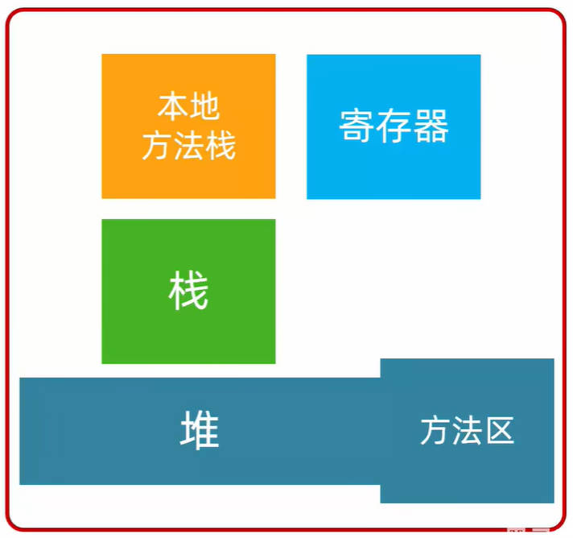
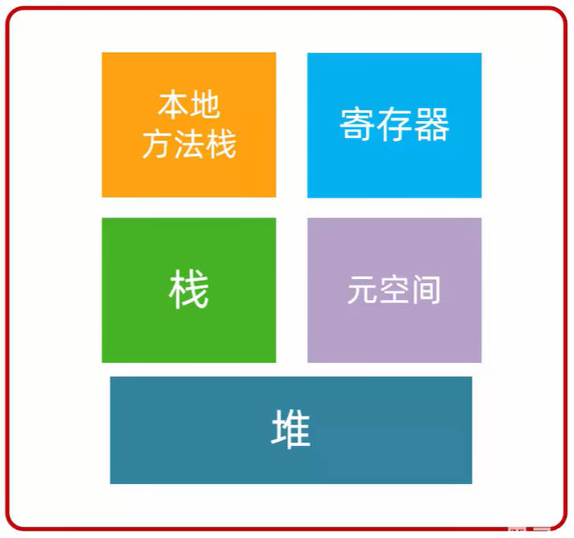
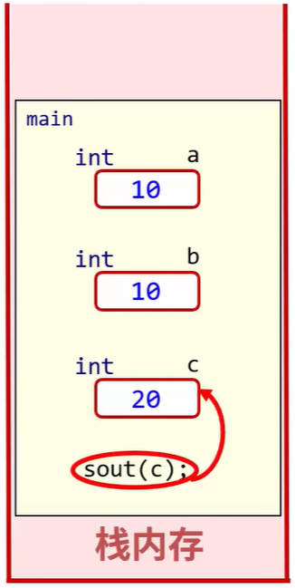

# Java 数组

数组指的是一种容器，可以同来存储同种数据类型的多个值。

数组容器在存储数据的时候，需要结合隐式转换考虑。比如：

- 定义了一个 int 类型的数组。
  - boolean。double 类型的数据，是不能存到这个数组中的，
  - byte，short，int 类型的数据是可以存到这个数组里面的。

建议：在 Java 中使用数组时，容器的类型，和存储的数据类型保持一致。比如：

- 整数 1, 2, 3, 4, 56 就可以使用 int 类型的数组来存储。
- 小数 1.1, 1.2, 1.3, 1.4 就可以使用 double 类型的数组来存储。
- 字符串"aaa"  "bbb"  "ccc" 就可以使用 String 类型的数组来存储。

## 一、Java 数组定义

在 Java 中，数组的定义，有两种方式：一般习惯使用方式一。

- 方式一：`数据类型[] 数组名`
  - 比如：`int[] array`
- 方式二：`数据类型  数组名[]`
  - 比如： `int array[]`

数据类型：限定了数组以后能存什么类型的数据。

方括号 `[]`：表示现在定义的是一个数组。

数组名：就是一个变量名，方便以后使用。

## 二、Java 数组初始化

数组的初始化，就是在内存中，为数组容器开辟空间，并将数组存入容器中的过程。

数组初始化的方式分为两种，分别是静态初始化，动态初始化。

### 1.数组静态初始化

数组的静态初始化，可分为“完整格式”和“简写格式”，一般习惯使用间歇格式。

#### 1.静态初始化完整格式

数组的静态初始化的完整格式是：`数据类型[] 数组名 = new 数据类型[]{元素一, 元素二, 元素三, ...}`

比如：初始化一个 int 类型的数组：

```java
int[] arr = new int[]{1, 2, 3};
```

比如：初始化一个 double 类型的数组：

```java
double[] arr = new double[]{1.11, 2.22, 3.33};
```

#### 2.静态初始化简写格式

数组的静态初始化的简写格式是：`数据类型[] 数组名 = {元素一, 元素二, 元素三, ...}`

比如：初始化一个 int 类型的数组：

```java
int[] arr = {1, 2, 3};
```

比如：初始化一个 double 类型的数组：

```java
double[] arr = {1.11, 2.22, 3.33};
```

注意：数组一旦初始化，它的长度也就固定下来，不能再改变了。

使用数组，存放一组学生的年龄，姓名，身高。

demo-project/base-code/Day06/src/com/kkcf/array/StaticInitialize.java

```java
package com.kkcf.array;

public class StaticInitialize {
    public static void main(String[] args) {
        // 年龄
        int[] ages1 = new int[]{18, 22, 21, 19, 23};
        int[] ages2 = {18, 22, 21, 19, 23};

        // 姓名
        String[] names1 = new String[]{"zhangsan", "lisi", "wangwu"};
        String[] names2 = {"zhangsan", "lisi", "wangwu"};

        // 身高
        double[] heights1 = new double[]{1.78, 1.68, 1.69, 1.75, 1.70};
        double[] heights2 = {1.78, 1.68, 1.69, 1.75, 1.70};
    }
}
```

### 2.数组动态初始化

Java 数组动态初始化，指的是在数组初始化时，只指定数组的长度，由系统为数组分配初始值。

数组动态初始化的格式为：`数据类型[] 数组名 = new 数组类型[数组长度];`

比如：动态初始化一个长度为 3 的 int 类型数组。

```java
int[] arr = new int[3];
```

#### 1.数组初始化默认值

案例理解：定义一个数组，用来存放班级中 50 个学生的姓名，姓名未知，要等学生报道后，再进行添加：

demo-project/base-code/Day06/src/com/kkcf/array/ArrayDynamicInitialization.java

```java
package com.kkcf.array;

public class ArrayDynamicInitialization {
    public static void main(String[] args) {
        String[] names = new String[50];

        names[0] = "张三";
        names[1] = "李四";

        System.out.println(names[0]);
        System.out.println(names[1]);
        System.out.println(names[2]); // 数组初始化默认值：null
    }
}
```

数组初始化值的默认值，根据数组类型的不同而不同：

- 整数类型的数组，初始化值为：`0`
- 小数类型的数组，初始化值为：`0.0`
- 布尔类型的数组，初始化值为：`false`
- 字符类型的数组，初始化值为：`'\u0000'`，展示为一个空格；
- 引用类型的数组，初始化值为：`null`

### 3.数组静态初始化、动态初始化的区别

静态初始化：手动指定数组的元素，系统会根据元素的个数，计算出数组的长度。

动态初始化：手动指定数组长度，由系统给出默认初始化值。

它们的使用场景：

- 动态初始化：只明确元素个数，但是不明确具体的数据。
- 静态初始化，已经明确了要操作的所有数据。

## 三、Java 数组的地址值

使用打印语句，打印定义的数组，会得到一个地址值。

demo-project/base-code/Day06/src/com/kkcf/array/StaticInitialize.java

```java
package com.kkcf.array;

public class StaticInitialize {
    public static void main(String[] args) {
        int[] ages1 = new int[]{18, 22, 21, 19, 23};

        System.out.println(ages1); // [I@4eec7777
    }
}
```

数组的地址值，表示数组在内存中的位置，上方代码中，地址值 `[I@4eec7777` 的含义如下：

- `[`，表示这个地址上是一个数组。
- `I`，表示这个数组是 int 类型的。
- `@`，表示一个间隔符号（固定格式）。
- `4eec7777`，表示数组真正的地址值，它是十六进制的表示形式。

## 四、Java 数组元素的访问

访问 Java 数组中的元素，格式为：`数组名[索引]`。

Java 数组的索引，也称“下标”、“角标”。

Java 索引的特点是从 0 开始，逐个 +1 增长，连续不间断。

索引可用于获取数组中的元素。

demo-project/base-code/Day06/src/com/kkcf/array/ArrayIndex.java

```java
package com.kkcf.array;

public class ArrayIndex {
    public static void main(String[] args) {
        int[] arr = {1, 2, 3, 4, 5};

        int a = arr[0];

        System.out.println(a); // 1
        System.out.println(arr[1]); // 2
    }
}

```

索引也可用于把数据存储到数组中，原来的数据，就被覆盖了。

demo-project/base-code/Day06/src/com/kkcf/array/ArrayIndex.java

```java
package com.kkcf.array;

public class ArrayIndex {
    public static void main(String[] args) {
        int[] arr = {1, 2, 3, 4, 5};

        arr[0] = 100;

        System.out.println(arr[0]); // 100
    }
}
```

## 五、Java 数组遍历

数组的遍历，就是把数组里面所有的内容一个一个全部取出来的过程。

数组有一个属性 `length`，表示数组的长度，用该属性，结合循环，对数组进行遍历。

demo-project/base-code/Day06/src/com/kkcf/array/ArrayTraversal.java

```java
package com.kkcf.array;

public class ArrayTraversal {
    public static void main(String[] args) {
        int[] arr = {1, 2, 3, 4, 5};

        for (int i = 0; i < arr.length; i++) {
            System.out.println(arr[i]);
        }

    }
}
```

案例理解：定义一个数组，存储 1-10，遍历数组得到每一个元素，要求：如果是奇数，则将当前数组扩大两倍；如果是偶数，则将当前数字变成二分之一。

demo-project/base-code/Day06/src/com/kkcf/array/ArrayTest01.java

```java
package com.kkcf.array;

public class ArrayTest01 {
    public static void main(String[] args) {
        int[] arr = {1, 2, 3, 4, 5, 6, 7, 8, 9, 10};

        for (int i = 0; i < arr.length; i++) {
            if (arr[i] % 2 == 0)
                arr[i] /= 2;
            else
                arr[i] *= 2;
        }

        for (int i = 0; i < arr.length; i++) {
            System.out.println(arr[i]);
        }
    }
}
```

- 一个循环只做一件事情，这样代码可读性更高。

## 六、Java 数组常见问题

Java 数组使用时，常见的问题是“索引越界异常”。

### 1.索引越界异常

在使用 Java 数组时，当访问了数组中不存在的索引，就会引发索引越界异常。

demo-project/base-code/Day06/src/com/kkcf/array/ArrayErrorDemo01.java

```java
package com.kkcf.array;

public class ArrayErrorDemo01 {
    public static void main(String[] args) {
        int[] arr = {1, 2, 3, 4, 5};

        System.out.println(arr[10]);
        // Exception in thread "main" java.lang.ArrayIndexOutOfBoundsException: Index 10 out of bounds for length 5
        //at com.kkcf.array.ArrayErrorDemo01.main(ArrayErrorDemo01.java:8)
    }
}
```

要避免这个异常，就要明确数组的最小索引是 `0`，最大索引是 `arr.length - 1`。

## 七、Java 数组练习

### 1.求最值

已知数组元素为 `{33, 5, 22, 44, 55}`，找出数组中最大值，并打印在控制台。

demo-project/base-code/Day06/src/com/kkcf/array/ArrayTest02.java

```java
package com.kkcf.array;

public class ArrayTest02 {
    public static void main(String[] args) {
        int[] arr = {33, 5, 22, 44, 55};

        int max = arr[0];

        for (int i = 1; i < arr.length; i++) {
            if (arr[i] > max) max = arr[i];
        }

        System.out.println(max);
    }
}
```

### 2.遍历数组求和

在 0-100 的范围内，生成 10 个数字，放入数组中，求这 10 个数字的和，平均数，并统计有多少数据比平均数小。

demo-project/base-code/Day06/src/com/kkcf/array/ArrayTest03.java

```java
package com.kkcf.array;

import java.util.Random;

public class ArrayTest03 {
    public static void main(String[] args) {
        Random r = new Random();

        // 定义数组
        int[] nums = new int[10];

        // 填充随机数
        for (int i = 0; i < nums.length; i++) {
            nums[i] = r.nextInt(100) + 1; // 0-100
        }

        // 打印这个数组
        System.out.print("[");
        for (int i = 0; i < nums.length; i++) {
            String ele = i != nums.length - 1 ? nums[i] + ", " : nums[i] + "";
            System.out.print(ele);
        }
        System.out.println("]");

        // 求和
        int sum = 0;
        for (int i = 0; i < nums.length; i++) {
            sum += nums[i];
        }
        System.out.println("和为 " + sum);

        // 求平均数
        double average = (double) sum / nums.length;
        System.out.println("平均数为 " + average);

        // 统计有多少数字小于平均数
        int count = 0;
        for (int i = 0; i < nums.length; i++) {
            if (nums[i] < average) count++;
        }
        System.out.println("小于平均数的个数为 " + count);
    }
}
```

### 3.交换数组中的元素

定义一个数组，存入 1, 2, 3, 4, 5，按照要求交换索引对应的元素：交换前：1, 2, 3, 4, 5；交换后：5, 4, 3, 2, 1。

demo-project/base-code/Day06/src/com/kkcf/array/ArrayTest04.java

```java
package com.kkcf.array;

public class ArrayTest04 {
    public static void main(String[] args) {
        int[] arr = {1, 2, 3, 4, 5};

        int i = 0;
        int j = arr.length - 1;
        int temp;

        for (; i != j; i++, j--) {
            temp = arr[i];
            arr[i] = arr[j];
            arr[j] = temp;
        }

        // 打印这个数组
        System.out.print("[");
        for (int x = 0; x < arr.length; x++) {
            String ele = x != arr.length - 1 ? arr[x] + ", " : arr[x] + "";
            System.out.print(ele);
        }
        System.out.println("]");
    }
}
```

- 使用变量 `temp` 作为临时变量，保存要交换的数据。

### 4.打乱数组中元素的顺序

定义一个数组，存入 1-5，要求随机打乱数组中所有元素的位置。

- 思路：从 `0` 索引对应的元素开始，用它和后面随机索引的元素进行交换。

demo-project/base-code/Day06/src/com/kkcf/array/ArrayTest05.java

```java
package com.kkcf.array;

import java.util.Random;

public class ArrayTest05 {
    public static void main(String[] args) {
        Random r = new Random();
        int[] arr = {1, 2, 3, 4, 5};

        // 数组索引交换
        int temo;
        for (int i = 0; i < arr.length; i++) {
            // 获取 i 后面的随机一个索引。
            int randomIndex = r.nextInt((arr.length - 1) - i + 1) + i;

            System.out.println("i = " + i + ", randomIndex = " + randomIndex);

            temo = arr[i];
            arr[i] = arr[randomIndex];
            arr[randomIndex] = temo;
        }

        // 打印这个数组
        System.out.print("[");
        for (int i = 0; i < arr.length; i++) {
            String ele = i != arr.length - 1 ? arr[i] + ", " : arr[i] + "";
            System.out.print(ele);
        }
        System.out.println("]");
    }
}
```

## 八、Java 内存分配

计算机中，每一个软件，在运行时，都要占据一块内存区域。

Java 的运行环境 JVM 虚拟机也不例外。

### 1.JVM 内存分配

JVM 为了更好的利用这块空间，将这块空间分为了五部分，它们分别是：

- **栈**：方法运行时使用的内存，比如 `main` 方法运行，就是进入方法栈中执行。
- **堆**：存储对象、数组等等引用类型的地方（`new` 关键字创建的实例，都存储在堆内存，它们都有地址值）。
- **方法区**：存储可以运行的 `.class` 文件。
- **本地方法栈**：JVM 在使用操作系统的功能时使用，和开发无关。
- **寄存器**：给 CPU 使用，和开发无关。

JDK 7 以前，方法区、堆空间，是连在一起的，在真是的物理内存当中，也是一块连续的空间。

但是这种设计方式并不好，后续再详细介绍。



JDK 8 开始，取消了方法区，新增了一块“元空间”：并把原来方法区的多种功能进行了拆分，有的功能放到了堆中，有的功能放到了元空间中。



### 2.Java 基本数据类型内存表现

下方代码，用于演示基本数据类型，在内存中的表现形式。

demo-project/base-code/Day06/src/com/kkcf/memory/BasicDataTypeMemory.java

```java
package com.kkcf.memory;

public class BasicDataTypeMemory {
    public static void main(String[] args) {
        int a = 10;
        int b = 20;
        int c = a + b;

        System.out.println(c);
    }
}
```

它的内存表现形式，如下图所示：



### 3.Java 数组内存表现

下方代码，用于演示数组数据类型，在内存中的表现形式。

demo-project/base-code/Day06/src/com/kkcf/memory/ArrayMemory.java

```java
package com.kkcf.memory;

public class ArrayMemory {
    public static void main(String[] args) {
        int[] arr = new int[2];

        System.out.println(arr);
        System.out.println(arr[0]);
        System.out.println(arr[1]);

        arr[0] = 11;
        arr[1] = 22;

        System.out.println(arr[0]);
        System.out.println(arr[1]);

        System.out.println("--------------------");

        int[] arr2 = {33, 44, 55};

        System.out.println(arr2);
        System.out.println(arr[0]);
        System.out.println(arr[1]);
        System.out.println(arr[2]);
    }
}
```

它的内存表现形式，如下图所示：


- 使用 `new` 关键字，创建的对象实例，都会在堆空间中，开辟一块内存空间，每个内存空间都有对应的地址值。

下方代码，用于演示当两个数组类型的变量，指向同一块顿内存空间时的场景。

demo-project/base-code/Day06/src/com/kkcf/memory/ArrayMemory02.java

```java
package com.kkcf.memory;

public class ArrayMemory02 {
    public static void main(String[] args) {
        int[] arr1 = {11, 22};
        int[] arr2 = arr1;

        System.out.println(arr1[0]); // 11
        System.out.println(arr2[0]); // 11

        arr2[0] = 33;

        System.out.println(arr1[0]); // 33
        System.out.println(arr2[0]); // 33
    }
}
```

它的内存表现形式，如下图所示：


- 当两个数组类型的变量，指向同一块顿内存空间时，如果其中一个数组变量的引用，对数组中的元素进行了修改，那么另外一个数组变量的引用，访问到的数组中的元素，就是修改后的元素了。
