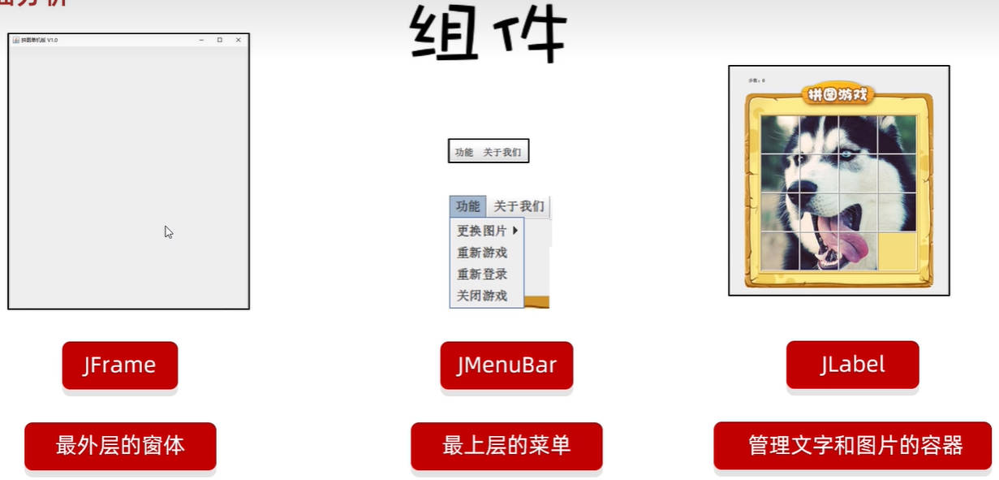
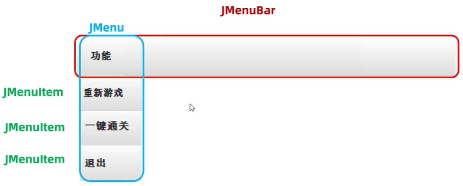

# Java 面向对象之拼图小游戏综合练习（一）

## 一、Java GUI 介绍

图形化用户界面（Graphic User Interface），又称图形用户接口，简称 GUI。

Java 中的 GUI 有两套体系。

- AWT 包，最先推出，有兼容性问题，显示中文可能有乱码。
- Swing 包，用的比较多。

## 二、拼图小游戏主界面初始化

主界面由三部分组成：

- 第一部分：最外层窗体；使用 `JFrame`（Java Frame）组件开发。
- 第二部分：菜单：使用 `JMenuBar`（Java Menu Bar）组件开发。
- 第三部分：管理文字和图片的容器：使用 `JLabel`（Java Label）组件开发

> 在 `JFrame` 中，图片、文字、进度条……都可以称为组件。



在 Idea 中，创建一个宽 603 像素，高 680 像素的游戏主界面。

在 Idea 中，创建一个宽 488 像素，高 430 像素的登录界面。

在 Idea 中，创建一个宽 488 像素，高 500 像素的注册界面。

demo-project/puzzelgame/src/com/kkcf/ui/Test.java

```java
package com.kkcf.ui;

import javax.swing.*;

public class Test {
    public static void main(String[] args) {
        // 创建一个游戏的主界面
        JFrame gameJframe = new JFrame();
        // 设置界面尺寸
        gameJframe.setSize(603, 680);
        // 设置界面显示
        gameJframe.setVisible(true);

        // 创建一个登录界面
        JFrame loginJframe = new JFrame();
        loginJframe.setSize(488, 430);
        loginJframe.setVisible(true);

        // 创建一个注册界面
        JFrame registerJframe = new JFrame();
        registerJframe.setSize(488, 500);
        registerJframe.setVisible(true);
    }
}
```

将三个界面，分别抽取成三个类，将各自界面的逻辑，写在类中。

在类的构造方法中，设置界面的一些初始化信息，比如：

- 设置窗口的大小。
- 设置窗口标题。
- 设置窗口始终置顶
- 设置窗口居中展示
- 设置窗口的关闭模式

### 1.登录界面初始化

demo-project/puzzelgame/src/com/kkcf/ui/LoginJFrame.java

```java
package com.kkcf.ui;

import javax.swing.*;
import java.awt.*;

public class LoginJFrame extends JFrame {
    public LoginJFrame(){
        this.setSize(488, 430);

        // 设置窗口标题
        this.setTitle("拼图小游戏登录 V1.0");
        // 设置窗口始终置顶
        this.setAlwaysOnTop(true);
        // 设置窗口居中展示
        this.setLocationRelativeTo(null);
        // 设置窗口的关闭模式
        this.setDefaultCloseOperation(WindowConstants.EXIT_ON_CLOSE); // 表示关闭窗口后，虚拟机停止运行。

        this.setVisible(true);
    }
}
```

### 2.注册界面初始化

demo-project/puzzelgame/src/com/kkcf/ui/RegisterJFrame.java

```java
package com.kkcf.ui;

import javax.swing.*;

public class RegisterJFrame extends JFrame {
    public RegisterJFrame() {
        this.setSize(488, 500);

        // 设置窗口标题
        this.setTitle("拼图小游戏注册 V1.0");
        // 设置窗口始终置顶
        this.setAlwaysOnTop(true);
        // 设置窗口居中展示
        this.setLocationRelativeTo(null);
        // 设置窗口的关闭模式
        this.setDefaultCloseOperation(WindowConstants.EXIT_ON_CLOSE); // 表示关闭窗口后，虚拟机停止运行。

        this.setVisible(true);
    }
}
```

### 3.游戏界面初始化

demo-project/puzzelgame/src/com/kkcf/ui/RegisterJFrame.java

```java
package com.kkcf.ui;

import javax.swing.*;

public class GameJFrame extends JFrame {
    public GameJFrame() {
        this.setSize(603, 680);

        // 设置窗口标题
        this.setTitle("拼图小游戏 V1.0");
        // 设置窗口始终置顶
        this.setAlwaysOnTop(true);
        // 设置窗口居中展示
        this.setLocationRelativeTo(null);
        // 设置游戏的关闭模式
        this.setDefaultCloseOperation(WindowConstants.EXIT_ON_CLOSE); // 表示关闭窗口后，虚拟机停止运行。

        this.setVisible(true);
    }
}
```

## 三、程序的入口

创建一个 `App` 类，用于程序的启动。

demo-project/puzzelgame/src/com/kkcf/ui/App.java

```java
package com.kkcf.ui;

public class App {
    public static void main(String[] args) {
        // 打开登录界面
        new LoginJFrame();
    }
}
```

## 四、游戏主界面菜单（一）

### 1.游戏主界面菜单添加

在 Java 中，菜单栏使用 `JMenuBar` 表示，菜单选项卡用 `JMenu` 表示，菜单条目用 `JMenuItem` 表示。

它们的关系如下图所示：



在游游戏界面（窗口），进行设置。

demo-project/puzzelgame/src/com/kkcf/ui/GameJFrame.java

```java
package com.kkcf.ui;

import javax.swing.*;

public class GameJFrame extends JFrame {
    public GameJFrame() {
        this.setSize(603, 680);

        // 设置窗口标题
        this.setTitle("拼图小游戏 V1.0");
        // 设置窗口始终置顶
        this.setAlwaysOnTop(true);
        // 设置窗口居中展示
        this.setLocationRelativeTo(null);
        // 设置游戏的关闭模式
        this.setDefaultCloseOperation(WindowConstants.EXIT_ON_CLOSE); // 表示关闭窗口后，虚拟机停止运行。

        // 初始化菜单栏对象
        JMenuBar jMenuBar = new JMenuBar();

        // 初始化菜单选项对象
        JMenu functionMenu = new JMenu("功能");
        JMenu aboutMenu = new JMenu("关于我们");

        // 创建菜单条目对象
        JMenuItem replayItem = new JMenuItem("重新游戏");
        JMenuItem reLoginItem = new JMenuItem("重新登录");
        JMenuItem closeItem = new JMenuItem("关闭游戏");
        JMenuItem accountItem = new JMenuItem("公众号");

        // 将菜单条目，添加到惨选项中
        functionMenu.add(replayItem);
        functionMenu.add(reLoginItem);
        functionMenu.add(closeItem);
        aboutMenu.add(accountItem);

        // 将菜单选项，添加到菜单栏中
        jMenuBar.add(functionMenu);
        jMenuBar.add(aboutMenu);

        // 给整个界面，设置菜单
        this.setJMenuBar(jMenuBar);;

        this.setVisible(true);
    }
}
```

我们发现，上方代码中，构造方法里的代码太多，对其进行抽取：

demo-project/puzzelgame/src/com/kkcf/ui/GameJFrame.java

```java
package com.kkcf.ui;

import javax.swing.*;

public class GameJFrame extends JFrame {
    public GameJFrame() {
        // super() // 隐式调用了父类的空参构造

        initJFrame();

        initJMenuBar();

        // 窗口设为可见。
        this.setVisible(true);
    }

    /**
     * 此方法用于，初始化游戏窗口
     */
    private void initJFrame() {
        this.setSize(603, 680);

        // 设置窗口标题
        this.setTitle("拼图小游戏 V1.0");
        // 设置窗口始终置顶
        this.setAlwaysOnTop(true);
        // 设置窗口居中展示
        this.setLocationRelativeTo(null);
        // 设置游戏的关闭模式
        this.setDefaultCloseOperation(WindowConstants.EXIT_ON_CLOSE); // 表示关闭窗口后，虚拟机停止运行。

        // 取消默认的居中设置，这样才能按照 x、y 轴的形式添加组件
        this.setLayout(null);
    }

    /**
     * 此方法用于，初始化菜单栏
     */
    private void initJMenuBar() {
        // 初始化菜单栏对象
        JMenuBar jMenuBar = new JMenuBar();

        // 初始化菜单选项对象
        JMenu functionMenu = new JMenu("功能");
        JMenu aboutMenu = new JMenu("关于我们");

        // 创建菜单条目对象
        JMenuItem replayItem = new JMenuItem("重新游戏");
        JMenuItem reLoginItem = new JMenuItem("重新登录");
        JMenuItem closeItem = new JMenuItem("关闭游戏");
        JMenuItem accountItem = new JMenuItem("公众号");

        // 将菜单条目，添加到惨选项中
        functionMenu.add(replayItem);
        functionMenu.add(reLoginItem);
        functionMenu.add(closeItem);
        aboutMenu.add(accountItem);

        // 将菜单选项，添加到菜单栏中
        jMenuBar.add(functionMenu);
        jMenuBar.add(aboutMenu);

        // 给整个界面，设置菜单
        this.setJMenuBar(jMenuBar);
    }
}
```

- `setLayout(null)` 方法，用于取消 `JFrame` 容器默认的居中设置，这样才能按照 x、y 轴的形式添加组件。为后续添加图片做准备。

### 2.游戏主界面图片添加

Java 中，图形化界面中的图片，对应的类是 `ImageIcon`；

要将 `ImageIcon` 的图片实例对象，放入 `JLabel` 进行管理。

> `JLabel` 可以管理图片和文字。

将静态资源文件夹 `image` 放入当前项目（project）的模块（module）目录下：

- 将图片放在窗口的左上角。

demo-project/puzzelgame/src/com/kkcf/ui/GameJFrame.java

```java
package com.kkcf.ui;

import javax.swing.*;

public class GameJFrame extends JFrame {
    public GameJFrame() {
        initJFrame();

        initJMenuBar();

        initImage();

        // 窗口设为可见。
        this.setVisible(true);
    }

    /**
     * 此方法用于：初始化图片
     */
    private void initImage() {
        // 创建 ImageIcon 对象
        ImageIcon icon =  new ImageIcon("image\\animal\\animal3\\3.jpg");

        // 创建 JLabel 对象（管理容器）
        JLabel jLabel = new JLabel(icon);

        // 指定图片的位置
        jLabel.setBounds(0, 0, 105, 105);  // 图片都是 105 * 105 的尺寸。

        // 获取隐藏的容器，再添图片容器
        this.getContentPane().add(jLabel);
    }

    // ...
}
```

- `getContentPane()` 方法，用于获取 `JFrame` 中的隐藏容器。

优化上方代码，使用循环。将其它的图片，也添加到容器中。

demo-project/puzzelgame/src/com/kkcf/ui/GameJFrame.java

```java
/**
 * 此方法用于：初始化图片
 */
private void initImage() {
    int number = 1;

    for (int i = 0; i < 4; i++) {
        for (int j = 0; j < 4; j++) {
            // 创建 ImageIcon 对象
            ImageIcon icon = new ImageIcon("image\\animal\\animal3\\"+ (number++) +".jpg");

            // 创建 JLabel 对象（管理容器）
            JLabel jLabel = new JLabel(icon);

            // 指定图片的位置
            jLabel.setBounds(105 * j, 105 * i, 105, 105);  // 图片都是 105 * 105 的尺寸。

            // 获取隐藏的容器，再添图片容器
            this.getContentPane().add(jLabel);
        }
    }
}
```

- 当 `number` 为 16 时，没有加载到对应的图片名，那么 `jLabel` 会添加一个空的图片对象。

### 3.游戏主界面打乱图片

思路：创建一个一维数组，长度为 16，里面存储 0-15 的数字，代表图片的位置。

打乱这个一维数组中元素的顺序，并且按照 4 个一组的形式，添加到二维数组中。

根据二维数组的索引，设置来添加图片容器：

> ArrayList 和数组如何选择：
>
> - 长度固定，使用数组；
> - 长度不固定，使用容器。

demo-project/puzzelgame/src/com/kkcf/ui/GameJFrame.java

```java
package com.kkcf.ui;

import javax.swing.*;
import java.util.Random;

public class GameJFrame extends JFrame {
    int[][] data = new int[4][4];

    public GameJFrame() {
        initJFrame();

        initJMenuBar();

        // 初始化数据
        initData();

        initImage();

        // 窗口设为可见。
        this.setVisible(true);
    }

    //...

    /**
     * 此方法用于初始化图片随机位置
     */
    private void initData() {
        Random r = new Random();

        int[] arr = {1, 2, 3, 4, 5, 6, 7, 8, 9, 10, 11, 12, 13, 14, 15};

        int len = arr.length;
        for (int i = 0; i < len; i++) {
            int randomIndex = r.nextInt(len);

            int temp = arr[i];
            arr[i] = arr[randomIndex];
            arr[randomIndex] = temp;
        }


        for (int i = 0; i < arr.length; i++)
            this.data[i / 4][i % 4] = arr[i];
    }

    /**
     * 此方法用于：初始化图片
     */
    private void initImage() {
        int number = 1;

        for (int i = 0; i < 4; i++) {
            for (int j = 0; j < 4; j++) {
                // 创建 ImageIcon 对象
                ImageIcon icon = new ImageIcon("image\\animal\\animal3\\"+ this.data[i][j] +".jpg");

                // 创建 JLabel 对象（管理容器）
                JLabel jLabel = new JLabel(icon);

                // 指定图片的位置
                jLabel.setBounds(105 * j, 105 * i, 105, 105);  // 图片都是 105 * 105 的尺寸。

                // 获取隐藏的容器，再添图片容器
                this.getContentPane().add(jLabel);
            }
        }
    }

    // ...
}
```

> 如果要对项目中的代码进行临时的测试，一般会在 module 模块下再创建一个名为 `test` 的包。

## 五、Java 中的事件

事件，是可以被组件识别的操作。触发组件的事件，就会执行对应的代码。

事件有以下要素：

- 事件源：按钮、图片、窗体……
- 事件，表示某些操作；比如：鼠标单击、鼠标划入。
- 绑定监听，表示当事件源上发生了某个事件，则执行某些代码。常用的绑定监听有：
  - `KeyListener` 键盘监听；
  - `MouseListenner` 鼠标监听；
  - `ActionListenner` 动作监听（只能监听鼠标的单击，和键盘的空格）

### 1.ActionListenner 动作监听

为组件添加事件监听的两种方式：

方式一，使用匿名内部类；

demo-project/puzzelgame/src/com/kkcf/test/Test2.java

```java
package com.kkcf.test;

import javax.swing.*;
import java.awt.event.ActionEvent;
import java.awt.event.ActionListener;

public class Test2 {
    public static void main(String[] args) {
        JFrame jFrame = new JFrame();

        jFrame.setSize(603, 680);
        // 设置窗口标题
        jFrame.setTitle("拼图小游戏 V1.0");
        // 设置窗口始终置顶
        jFrame.setAlwaysOnTop(true);
        // 设置窗口居中展示
        jFrame.setLocationRelativeTo(null);
        // 设置游戏的关闭模式
        jFrame.setDefaultCloseOperation(WindowConstants.EXIT_ON_CLOSE); // 表示关闭窗口后，虚拟机停止运行。
        // 取消默认的居中设置，这样才能按照 x、y 轴的形式添加组件
        jFrame.setLayout(null);

        // 创建一个按钮对象
        JButton jbtn = new JButton("点我啊");
        // 设置位置和宽高
        jbtn.setBounds(0, 0, 100, 50);

        // 为 jbtn 添加事件监听。
        // addActionListener 方法，表示动作监听，只能监听鼠标左键点击，和键盘空格；传入的参数，表示事件触发后要执行的代码
        // 创建一个自己的实现类 MyActionListenner，实现 ActionListener 接口，并创建对象传入 addActionListener 方法中。
        // jbtn.addActionListener(new MyActionListenner());
       
        // 因为 MyActionListenner 类只会在这里使用到一次，所以使用匿名内部类，简化代码。
        jbtn.addActionListener(new ActionListener() {
            @Override
            public void actionPerformed(ActionEvent e) {
                System.out.println("不要点我啊");
            }
        });

        // 把 jbtn 添加到页面中。
        jFrame.getContentPane().add(jbtn);

        jFrame.setVisible(true);
    }
}
```

方式二：使用接口的实现。

为 `MyFrame` 类，实现 `ActionListener` 接口，并实现其中的方法。

demo-project/puzzelgame/src/com/kkcf/test/MyFrame.java

```java
package com.kkcf.test;

import javax.swing.*;
import java.awt.event.ActionEvent;
import java.awt.event.ActionListener;
import java.util.Random;

public class MyFrame extends JFrame implements ActionListener {
    // 创建一个按钮对象
    JButton jbtn1 = new JButton("点我啊");

    // 创建一个按钮对象
    JButton jbtn2 = new JButton("再点我啊");

    public MyFrame(){
        this.setSize(603, 680);
        // 设置窗口标题
        this.setTitle("拼图小游戏 V1.0");
        // 设置窗口始终置顶
        this.setAlwaysOnTop(true);
        // 设置窗口居中展示
        this.setLocationRelativeTo(null);
        // 设置游戏的关闭模式
        this.setDefaultCloseOperation(WindowConstants.EXIT_ON_CLOSE); // 表示关闭窗口后，虚拟机停止运行。
        // 取消默认的居中设置，这样才能按照 x、y 轴的形式添加组件
        this.setLayout(null);

        // 设置位置和宽高
        jbtn1.setBounds(0, 0, 100, 50);
        // MyFrame 类实现了 ActionListener 接口，所以可以直接传入 MyFrame 类的对象。
        jbtn1.addActionListener(this);

        // 设置位置和宽高
        jbtn2.setBounds(100, 0, 100, 50);
        // MyFrame 类实现了 ActionListener 接口，所以可以直接传入 MyFrame 类的对象。
        jbtn2.addActionListener(this);

        this.getContentPane().add(jbtn1);
        this.getContentPane().add(jbtn2);

        this.setVisible(true);
    }

    @Override
    public void actionPerformed(ActionEvent e) {
        Random r = new Random();

        // 对当前按钮，进行判断
        Object source = e.getSource();
        if (source == jbtn1)
            jbtn1.setSize(200, 200); // 扩大 jbtn1 的尺寸
        else if (source == jbtn2)
            jbtn2.setLocation(r.nextInt(500), r.nextInt(500)); // 随机设置 jbtn2 的位移
    }
}
```

测试类

demo-project/puzzelgame/src/com/kkcf/test/Test3.java

```java
package com.kkcf.test;

public class Test3 {
    public static void main(String[] args) {
        new MyFrame();
    }
}
```

### 2.MouseListenner 鼠标监听

`ActionListenner` 动作监听，只能监听鼠标的点击事件，或者键盘的空格。

`MouseListenner` 鼠标监听，可以监听鼠标的：

- `mouseEntered` 划入动作
- `mousePressed` 按下动作
- `mouseReleased` 松开动作
- `mouseExited` 划出动作
- 按下动作，松开动作又可归为 `mouseClicked` 单击动作。

所以，在 Java 中，监听一个按钮的点击事件，有以下几种写法：

- 写法一：`ActionListenner` 动作监听的 `actionPerformed` 事件，
- 写法二：`MouseListenner` 鼠标监听的 `mouseClicked` 单击事件，
- 写法三：`MouseListenner` 鼠标监听的 `mouseReleased` 松开事件。

案例理解，使用 Java 创建一个窗口，在其中添加一个按钮，并为这个按钮，添加鼠标事件（使用实现接口的方式）。

demo-project/puzzelgame/src/com/kkcf/test/MyFrame2.java

```java
package com.kkcf.test;

import javax.swing.*;
import java.awt.event.MouseEvent;
import java.awt.event.MouseListener;

public class MyFrame2 extends JFrame implements MouseListener {
    // 创建一个按钮对象
    JButton jbtn1 = new JButton("点我啊");

    public MyFrame2() {
        this.setSize(603, 680);
        // 设置窗口标题
        this.setTitle("拼图小游戏 V1.0");
        // 设置窗口始终置顶
        this.setAlwaysOnTop(true);
        // 设置窗口居中展示
        this.setLocationRelativeTo(null);
        // 设置游戏的关闭模式
        this.setDefaultCloseOperation(WindowConstants.EXIT_ON_CLOSE); // 表示关闭窗口后，虚拟机停止运行。
        // 取消默认的居中设置，这样才能按照 x、y 轴的形式添加组件
        this.setLayout(null);

        // 设置按钮位置和宽高
        jbtn1.setBounds(0, 0, 100, 50);
        // 给按钮绑定鼠标事件
        jbtn1.addMouseListener(this);

        this.getContentPane().add(jbtn1);

        this.setVisible(true);
    }

    @Override
    public void mouseClicked(MouseEvent e) {
        System.out.println("单击");
    }

    @Override
    public void mousePressed(MouseEvent e) {
        System.out.println("按下");
    }

    @Override
    public void mouseReleased(MouseEvent e) {
        System.out.println("松开");
    }

    @Override
    public void mouseEntered(MouseEvent e) {
        System.out.println("划入");
    }

    @Override
    public void mouseExited(MouseEvent e) {
        System.out.println("划出");
    }
}
```

测试类：

在测试类中打开 `MyFrame2` 窗口。

demo-project/puzzelgame/src/com/kkcf/test/Test3.java

```java
package com.kkcf.test;

public class Test3 {
    public static void main(String[] args) {
        new MyFrame2();
    }
}
```

### 3.KeyListener 键盘监听

KeyListener 键盘监听，可以监听键盘的：

- `keyPressed` 按下动作；
- `keyReleased` 松开动作；
- `keyTyped` 键入动作（有局限性，Ctrl、Alt 等等键不能监听）。

案例理解，使用 Java 创建一个窗口，在给这个窗口，添加键盘的事件监听。

demo-project/puzzelgame/src/com/kkcf/test/MyFrame3.java

```java
package com.kkcf.test;

import javax.swing.*;
import java.awt.event.KeyEvent;
import java.awt.event.KeyListener;

public class MyFrame3 extends JFrame implements KeyListener {
    public MyFrame3() {
        this.setSize(603, 680);
        // 设置窗口标题
        this.setTitle("拼图小游戏 V1.0");
        // 设置窗口始终置顶
        this.setAlwaysOnTop(true);
        // 设置窗口居中展示
        this.setLocationRelativeTo(null);
        // 设置游戏的关闭模式
        this.setDefaultCloseOperation(WindowConstants.EXIT_ON_CLOSE); // 表示关闭窗口后，虚拟机停止运行。
        // 取消默认的居中设置，这样才能按照 x、y 轴的形式添加组件
        this.setLayout(null);

        // 一般是给整个窗体，添加键盘监听
        // 调用者 this，表示本类对象，当前的界面对象，表示要给整个界面添加监听
        // addKeyListener：表示要给本界面添加键盘监听
        // 参数 this，当事件被触发之后，会执行本类中对应的代码
        this.addKeyListener(this);

        this.setVisible(true);
    }

    @Override
    public void keyTyped(KeyEvent e) {
        //System.out.println("键入");
    }

    // 细节 1：如果按下一个按键，没有松开，那么会去重复调用 keyPressed 方法
    @Override
    public void keyPressed(KeyEvent e) {
        System.out.println("按下");
    }

    // 细节 2：键盘中的按键，如何区分，使用 e.getKeyCode() 获取键盘按键的代号（与 ASCLL 码表无关）
    @Override
    public void keyReleased(KeyEvent e) {
        System.out.println("松开");
        int keyCode = e.getKeyCode();
        System.out.println("keyCode: " + keyCode);
    }
}
```
