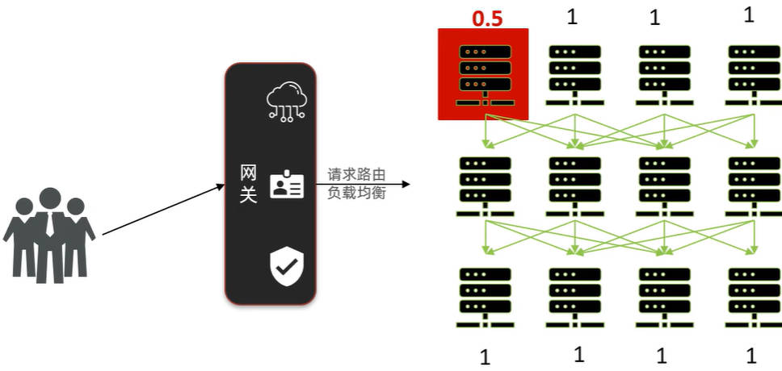
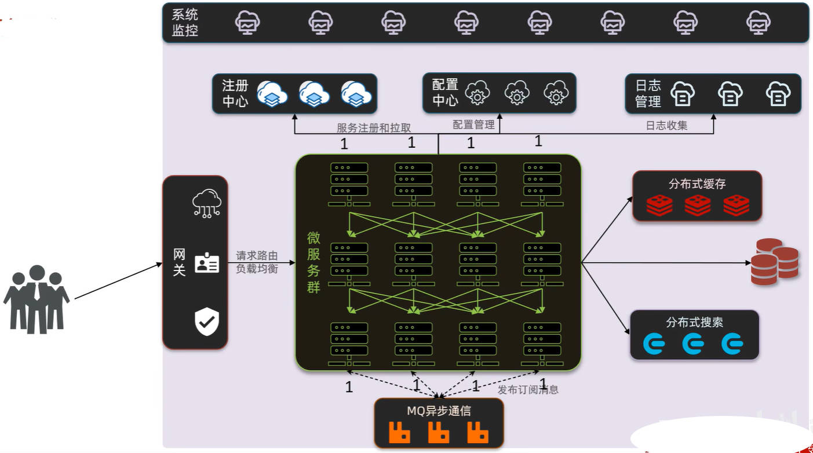

# Java 常用 API 之 Collections 工具类、可变参数、综合练习

## 一、Java 可变参数

定义一个方法，求若干个数字之和；

- 此时，不知道该方法传入的参数，有几个？

在没有可变参数前，做法是将所有的参数，封装成一个数组，再传入这个数组；如下方所示：

demo-project/base-code/Day24/src/com/kkcf/variableparam/Demo01.java

```java
package com.kkcf.variableparam;

public class Demo01 {
    public static int getSum(int[] arr) {
        int sum = 0;

        for (int i : arr)
            sum += i;

        return sum;
    }

    public static void main(String[] args) {
        int[] arr = {1, 2, 3, 4, 5};

        int sum = getSum(arr);

        System.out.println(sum); // 15
    }
}
```

可变参数是 JDK5 的新特性，它使得方法的形参的个数，是可以发生变化的。

Java 可变参数的书写格式：`数据类型...形参名`。

Java 可变参数，底层使用数组实现，会将传入的实参，放入到一个数组中：

使用可变参数，重构上方的代码：

demo-project/base-code/Day24/src/com/kkcf/variableparam/Demo02.java

```java
package com.kkcf.variableparam;

public class Demo02 {
    private static int getSum(int...args) {
        System.out.println(args);

        int sum = 0;

        for (int arg : args)
            sum += arg;

        return sum;
    }


    public static void main(String[] args) {
        int sum = getSum(1, 2, 3, 4, 5);

        System.out.println(sum); // 15
    }
}
```

Java 可变参数的特点：

- 方法的形参列表中，只能有**一个**可变参数，且要写在**最后面**；

## 二、Collections 工具类

`java.util.Collections` 是单列集合的工具类。

`Collections` 工具类，常用的方法如下：

| 方法名                                                       | 说明                                            |
| ------------------------------------------------------------ | ----------------------------------------------- |
| `static <T> boolean addAll(Collection<? super T> c, T... elements)` | 批量添加元素                                    |
| `static void shuffle(List<?> list)`                          | 打乱 List 集合中元素的顺序                      |
| `static <T extends Comparable<? super T>> void sort(List<T> list)` | 排序                                            |
| `static <T> void sort(List<T> list, Comparator<? super T> c)` | 排序，根据指定规则进行排序                      |
| `static <T> int binarySearch(List<? extends Comparable<? super T>> list, T key)` | 查找，以二分查找法查找 List 集合中的指定元素    |
| `static <T> void copy(List<? super T> dest, List<? extends T> src)` | 拷贝，拷贝 List 集合中的元素                    |
| `static <T> void fill(List<? super T> list, T obj)`          | 填充，使用指定的元素，填充 List 集合            |
| `static <T extends Object & Comparable<? super T>>T max/min(Collection<? extends T> coll)` | 最大最小值，根据默认的自然排序，获取最大/最小值 |
| `static void swap(List<?> list, int i, int j)`               | 交换，交换 List 集合中指定位置的元素            |

### 1.addAll、shuffle 方法

`Collections` 的 `addAll`、`shuffle` 方法的使用：

demo-project/base-code/Day24/src/com/kkcf/collections/Test1.java

```java
package com.kkcf.collections;

import java.util.ArrayList;
import java.util.Collections;

public class Test1 {
    public static void main(String[] args) {
        ArrayList<String> list = new ArrayList<>();

        // 为 Collection 单列集合，添加多个元素
        boolean flag = Collections.addAll(list, "abc", "cba", "nba", "yt", "o21", "utr");
        if (flag) System.out.println(list);

        // 打乱 Collection 单列集合中元素的排列顺序
        Collections.shuffle(list);

        System.out.println(list);
    }
}
```

## 三、综合练习

### 1.练习一

自动点名器：班级里有 N 个学生，学生有属性：姓名、年龄、性别；

实现随机点名器。

学生类：

demo-project/base-code/Day24/src/com/kkcf/javabean/Student.java

```java
package com.kkcf.javabean;

public class Student {
    private String name;
    private int age;
    private char sex;

    public Student() {
    }

    public Student(String name, int age, char sex) {
        this.name = name;
        this.age = age;
        this.sex = sex;
    }

    // getter、setter……

    @Override
    public String toString() {
        return "Student{" +
                "name='" + name + '\'' +
                ", age=" + age +
                ", sex=" + sex +
                '}';
    }
}
```

测试类

demo-project/base-code/Day24/src/com/kkcf/training/Test1.java

```java
package com.kkcf.test;

import com.kkcf.javabean.Student;

import java.util.ArrayList;
import java.util.Collections;
import java.util.Random;

public class Test1 {
    public static void main(String[] args) {
        ArrayList<Student> stuList = new ArrayList<>();

        Student stu1 = new Student("张三", 16, '男');
        Student stu2 = new Student("李四", 17, '女');
        Student stu3 = new Student("王五", 18, '男');
        Student stu4 = new Student("赵六", 19, '女');
        Student stu5 = new Student("田七", 20, '男');

        Collections.addAll(stuList, stu1, stu2, stu3, stu4, stu5);

        // 方式一
        Random r = new Random();
        Student randomStu1 = stuList.get(r.nextInt(stuList.size()));
        System.out.println(randomStu1.getName());

        // 方式二
        Collections.shuffle(stuList);
        Student randomStu2 = stuList.get(0);
        System.out.println(randomStu2.getName());
    }
}
```

### 2.练习二

自动点名器2：班级里有 N 个学生。要求：70% 的概率随机点名到男生；30% 的概率随机点名到女生；

- 思路：直接使用 `Random` 类，只能随机点；如果要随机面，要定义一个用于获取随机数的数组，把“点”转化为“面”：

demo-project/base-code/Day24/src/com/kkcf/training/Test2.java

```java
package com.kkcf.test;

import com.kkcf.javabean.Student;

import java.util.ArrayList;
import java.util.Collections;
import java.util.Random;

public class Test2 {
    public static void main(String[] args) {
        // 男学生列表集合
        ArrayList<Student> maleStu = new ArrayList<>();
        ArrayList<Student> femaleStu = new ArrayList<>();

        Student stu1 = new Student("张三", 16, '男');
        Student stu3 = new Student("王五", 18, '男');
        Student stu5 = new Student("田七", 20, '男');

        Collections.addAll(maleStu, stu1, stu3, stu5);

        // 女学生列表集合
        Student stu2 = new Student("李四", 17, '女');
        Student stu4 = new Student("赵六", 19, '女');

        Collections.addAll(femaleStu, stu2, stu4);

        // 随即面
        int[] arr = {0, 0, 0, 1, 1, 1, 1, 1, 1, 1};

        Random r = new Random();
        // 打乱顺序
        for (int i = 0; i < arr.length; i++) {
            int index = r.nextInt(arr.length);
            int temp = arr[i];
            arr[i] = arr[index];
            arr[index] = temp;
        }

        int i = r.nextInt(arr.length);
        if (i > 0) {
            System.out.println("点名男学生");
            int i1 = r.nextInt(maleStu.size());
            System.out.println(maleStu.get(i1));
        } else {
            System.out.println("点名女学生");
            int i1 = r.nextInt(femaleStu.size());
            System.out.println(femaleStu.get(i1));
        }
    }
}
```

### 3.练习三

自动点名器3：班级里有 N 个学生，被点到的学生，不会再点到；

如果班级中所有学生都点完了，需要重新开启第二轮点名。

- 思路：被点名的学生，从集合中删除。

demo-project/base-code/Day24/src/com/kkcf/training/Test3.java

```java
package com.kkcf.training;

import com.kkcf.javabean.Student;

import java.util.ArrayList;
import java.util.Collections;
import java.util.Random;

public class Test3 {
    public static void main(String[] args) {
        // 学生集合
        ArrayList<Student> stuList = new ArrayList<>();

        Student stu1 = new Student("张三", 18, '男');
        Student stu2 = new Student("李四", 19, '女');
        Student stu3 = new Student("王五", 20, '男');
        Student stu4 = new Student("赵六", 21, '女');
        Student stu5 = new Student("田七", 22, '男');

        boolean flag = Collections.addAll(stuList, stu1, stu2, stu3, stu4, stu5);
        if (!flag) return;

        // 随机点名，点 10 轮
        Random r = new Random();
        ArrayList<Student> tempList = new ArrayList<>();
        int size = stuList.size();

        // 外循环，轮数
        for (int i = 0; i < 10; i++) {
            System.out.println("开始第 " + (i + 1) + " 轮点名");

            // 内循环：点名
            for (int j = 0; j < size; j++) {
                int index = r.nextInt(stuList.size());
                Student stu = stuList.remove(index);
                System.out.println(stu.getName() + "，被点到了");

                boolean flag1 = tempList.add(stu);
                if (!flag1) return;
            }

            stuList.addAll(tempList); // 将 tempList 中的学生对象，添加到 stuList 中。
            tempList.clear();
        }
    }
}
```

### 4.练习四

自动点名器4：txt 文本文件中，事先准备好 80 个学生姓名，每个学生的名字，独占一行。

要求 1：每次被点到的学生，再次被点到的概率在原型的基础上降低一半。

举例：80 个学生，点名 5 次，每次都点到小 A，概率变化情况如下：

- 第一次每人概率：1.25%
- 第二次小 A 概率：0.625%
- 第三次小 A 概率：0.3125%

要求2：作弊要求，第三次点名一定是张三。

本题要用到集合、IO、权重随机算法；有序补全。

补充：微服务

将大项目，拆分成多个小项目，形成一个服务，每个服务又可以有服务器集群来部署。

当用户访问服务时，会根据网关（反向代理），计算服务器的权重，来确定应该访问哪台服务器。



完整的微服务架构：



### 5.练习五

定义一个 Map 集合，键表示省份 province，值表示城市 city；但是市会有多个，添加完毕后，遍历结果格式如下；

- 江苏省 = 南京市，扬州市，苏州市，无锡市，常州市
- 湖北省 = 武汉市，孝感市，十堰市，宜昌市，鄂州市
- 河北省 = 石家庄市，唐山市，邢台市，保定市，张家口市。

```java
package com.kkcf.training;

import java.util.*;

public class Test4 {
    public static void main(String[] args) {
        // 城市集合
        ArrayList<String> jiangsuCityList = new ArrayList<>();
        Collections.addAll(jiangsuCityList, "南京市", "扬州市", "苏州市", "无锡市", "常州市");

        ArrayList<String> hubeiCityList = new ArrayList<>();
        Collections.addAll(hubeiCityList, "武汉市", "孝感市", "十堰市", "宜昌市", "鄂州市");

        ArrayList<String> hebeiCityList = new ArrayList<>();
        Collections.addAll(hebeiCityList, "石家庄市", "唐山市", "邢台市", "保定市", "张家口市");

        // 省市集合
        HashMap<String, ArrayList<String>> map = new HashMap<>();

        map.put("江苏省", jiangsuCityList);
        map.put("湖北省", hubeiCityList);
        map.put("河北省", hebeiCityList);

        // 遍历打印
        for (Map.Entry<String, ArrayList<String>> entries : map.entrySet()) {
            String province = entries.getKey();
            ArrayList<String> cityList = entries.getValue();

            StringJoiner sj = new StringJoiner(", ", province + " = ", "");

            for (String city : cityList)
                sj.add(city);

            System.out.println(sj);
        }
    }
}
```
